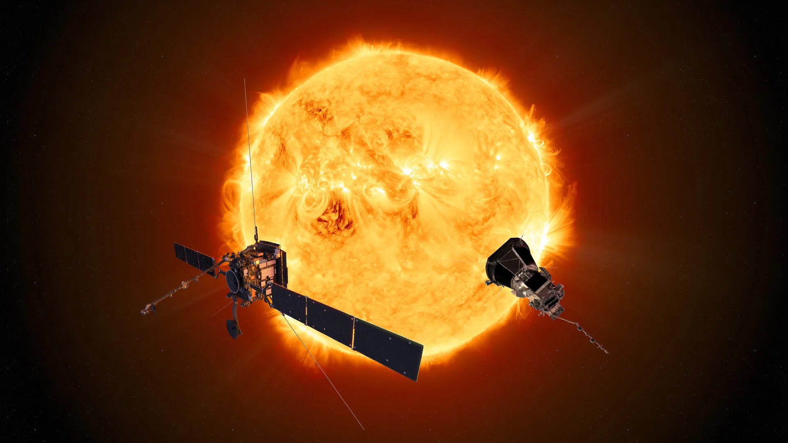

# Solar System Guide Gallery

Explore the wonders of the Solar System with this interactive web application. Dive into the fascinating world of celestial bodies, from the fiery Sun to the icy reaches of Pluto, all from the comfort of your device. This project leverages the power of web technologies to bring the universe a little closer to home.

## Description

The Solar System Guide Gallery is a collaborative web application designed to educate and entertain users by showcasing data on celestial bodies. Built with HTML, CSS, and JavaScript, it features SaaS modules for streamlined styling, OOP for encapsulated JavaScript execution, and is optimized for responsiveness across devices. Experience the cosmos with engaging GSAP animations and dynamic content generation for an interstellar journey from mobile to desktop screens.

## Version History

- **1.0** - Initial setup of project structure.
- **2.0** - Enhanced with images and comprehensive content for each celestial body.
- **3.0** - Integration of Object-Oriented Programming concepts for improved data management and responsiveness.
- **4.0** - Advanced JavaScript modularization and bundling with Parcel for efficient code organization and deployment.

## Key Features

- **Interactive Celestial Guide:** Click through the interactive list of celestial bodies to unveil their mysteries.
- **Responsive Layout:** Crafted for optimal viewing on any device, ensuring a seamless experience whether on desktop or mobile.
- **Visual Feedback:** A sophisticated loading spinner indicates data retrieval processes, enhancing user engagement.

## Getting Started

To explore the Solar System Guide Gallery:

1. Clone the GitHub repository or download the project files.
2. Open the project on your local machine.
3. Launch the application to begin your exploration of the Solar System.

## User Guide

Interact with the application using your mouse or touchpad. Click on the buttons to reveal detailed information about each. Navigate through the gallery using the intuitive interface designed for an engaging user experience.

## Contributors

- **Sahilkumar Gosaliya**: Spearheaded data manipulation and feature development.
- **Jonathan Yabes**: Masterminded the visual and auditory animation effects.

## License

This project is made available under the MIT License - see the LICENSE file for details.
